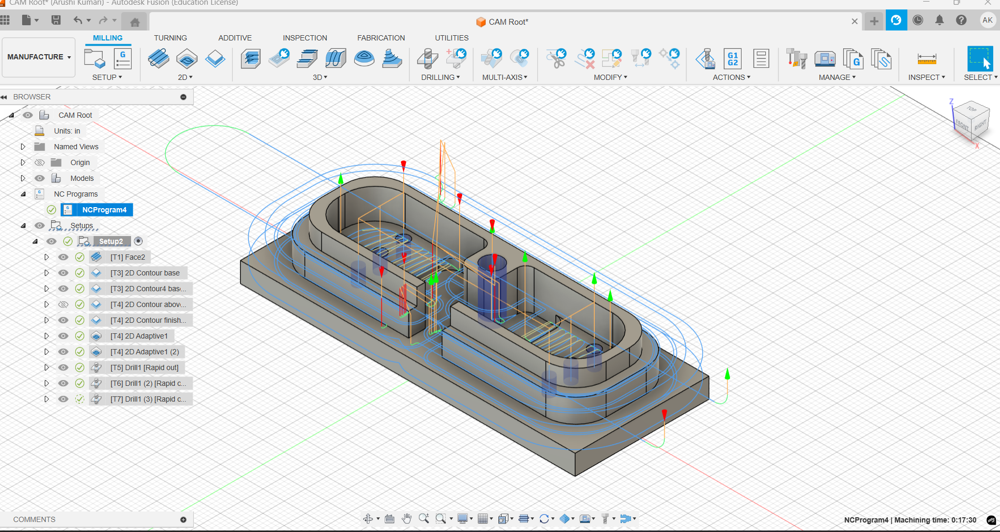

### CAM: Manufacturing Simulation

🔗 [View on Fusion 360](https://a360.co/4oFwMFe)

This project simulates CNC machining using Fusion 360 CAM.  
Includes toolpath generation, G-code verification, and realistic cutting visualization.

🎥 Watch the simulation:  
https://github.com/ArushiKumari/CAD-Models/blob/main/CAM-Simulation/CAM-Simulation.mp4
